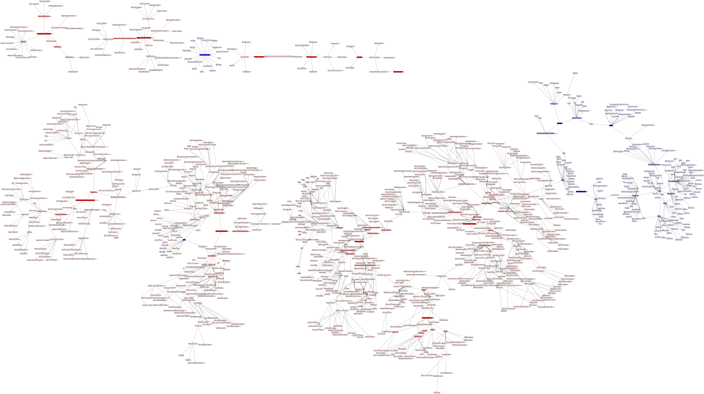

# Data Structures, Algorithms and Problem Types Knowledge graph

Data structures, Algorithms and Problem types Knowledge Graph based on wikipedia. A graphic representation of a graph where nodes are algorithms, data structures and problems types and the edges show how they interact. For example a subgraph of merge sort (algorithm), recursive (algorithm type), iterative (algorithm type), array (data structure) and sort (problem type) will mean that Merge sort is a recursive or iterative algorithm used to solve sorting problems using arrays. I am curious to see what other such sentences emerge from this knowledge graph. The source of information and connections is wikipedia.

## Steps on how the program works ##

* parses wikipedia page html using HtmlAgilityPack into a graph of nodes
* parses that graph of nodes into a knowledge graph because the nodes hierarchy doesn't correspond with the konwledge hierarchy
* displays this knowledge graph using MSAGL which is a graph displaying library

## Sources and tools used ##

* Microsoft Automatic Graph Layout - https://github.com/microsoft/automatic-graph-layout - Thank you!
* HtmlAgilityPack - https://html-agility-pack.net/ - Thank you!
* Wikipedia - https://www.wikipedia.org/ - Thank you!